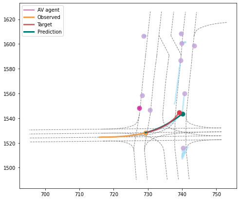
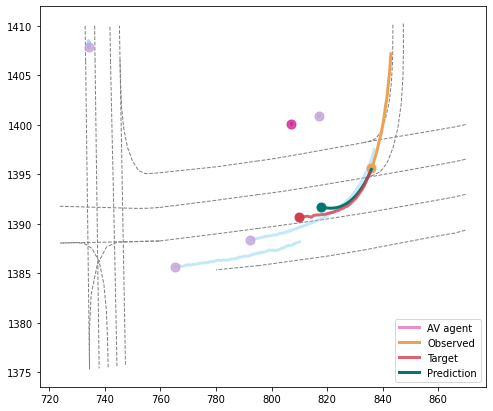
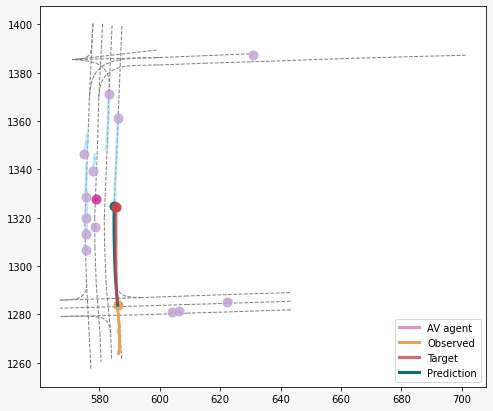
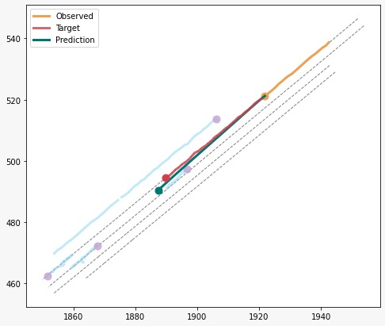

# Motion forecasting for Autonomous Vehicle using Argoverse Dataset

### Official Argoverse Links:
1) [Argoverse-API](https://github.com/argoai/argoverse-api.git)
2) [Argoverse-Forecasting Baselines](https://github.com/jagjeet-singh/argoverse-forecasting)
3) [Datasets](https://www.argoverse.org/data.html#download-link)

The origin code for Social GAN provided by Agrim Gupta et.al. has been modified with data preprocessing and integration of argoverse-api for the argoverse dataset.

**<a href="https://arxiv.org/abs/1803.10892">Social GAN: Socially Acceptable Trajectories with Generative Adversarial Networks</a>**

A better understanding of agents' behaviour in a dynamic traffic environment is required for an efficient modelling and navigation of autonomous vehicles. In this project we plan to address the problem of motion forecasting of traffic actors through experimentation on the Argoverse Motion Forecasting dataset. We attempt to tackle this challenge using Generative Adversarial Networks (GANs) and compare out results with baseline methods of seq-to-seq prediction and social LSTM provided by the Argoverse Challenge.

Below we show an examples of predictions made by our model in complex scenarios. Each traffic actor category is denoted by a different color. 

<div align='center'>




</div>

## Model
Our model consists of three key components: Generator (G), Pooling Module (PM) and Discriminator (D). G is based on encoder-decoder framework where we link the hidden states of encoder and decoder via PM. G takes as input trajectories of all people involved in a scene and outputs corresponding predicted trajectories. D inputs the entire sequence comprising both input trajectory and future prediction and classifies them as “real/fake”.

<div align='center'>
  
</div>

## Performance compared to Baselines
| BASELINE | ADE | FDE |
| :---: | :---: | :---: |
| Constant Velocity | 3.55 | 7.89 |
| LSTM ED | 2.27 | 5.19 |
| Social LSTM | 1.8 | 3.89 |
| Social GAN | 0.035 | 0.85 |

## Setup
All code was developed and tested on Ubuntu 16.04 with Python 3.6 and PyTorch.

You can setup a virtual environment to run the code like this:

```bash
conda create --name myenv python=3.6      # Create a virtual environment
conda activate myenv                      # Activate virtual environment
cd sgan/                                  # Navigate to the root directory of the repository
pip install -e argoverse-api              # install argoverse
pip install mypy                          # argoverse dependencies
```

## Download Dataset
You can download the dataset from argoverse website. 

## Running Models

```bash
sh scripts/run_traj_argo.sh
```

To visualize the trajectories, use `test_argo.ipynb`. Trained model is saved in the `saved_model` folder.

